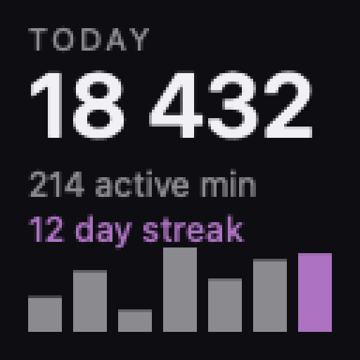

<h1 align="center">Keyboard Studio</h1>

<p align="center">
  <strong>Native macOS software for keyboards with RGB lighting and small screens.</strong><br>
  No Windows software, no virtual machine, no cloud — it talks to the keyboard directly over USB.
</p>

<p align="center">
  
  
  
  
</p>

---

Built and verified against the **Attack Shark K86**. Keyboards are described by
JSON profiles rather than code, so the same app covers other boards running the
same ROYUAN firmware — sold as **Epomaker**, **Akko**, **Hator**, **ikbc**,
**NOPPOO** and **MEETION**. Adding one is a data change: see
[ADDING-A-KEYBOARD.md](ADDING-A-KEYBOARD.md).

If you bought one of these keyboards and found only a Windows installer, this is
for you.

## What it does

**Lighting** — 19 firmware effects with an animated gallery: hover a tile and
that effect plays on a miniature drawing of your keyboard before you send it.
Solid colours, brightness and speed, and the side light strips.

**The screen** — send any image or animated GIF to the keyboard's TFT panel.
Non-square artwork is centre-cropped by default, with fit and stretch options.

**Your statistics, on the keyboard itself** — the panel can show today's key
count, active minutes, current streak and a seven-day sparkline. Nothing else
puts your own numbers on the device.

<p align="center">
  
  <br><em>Rendered at the panel's native resolution, shown enlarged</em>
</p>

**Typing statistics** — lifetime key counts, monthly champions, streaks, peak
hour. Counters only: the order of your keystrokes is never recorded, so the
stored data cannot reconstruct anything you typed. macOS itself withholds input
while a password field is focused, and the app shows you when that happens.
Details, schema and commands to verify the claims: [PRIVACY.md](PRIVACY.md).

**The knob** — reads what the rotary encoder's turn and press actions are
currently bound to.

**Turkish and English**, switchable in the app.

## Install

```sh
git clone https://github.com/mehmetnadir/keyboard-studio.git
cd keyboard-studio
swift build -c release
./scripts/bundle.sh release        # builds Keyboard Studio.app
open "build/Keyboard Studio.app"
```

Requires macOS 14 or later and an Xcode 16+ toolchain. There are no third-party
dependencies — everything is IOKit, SwiftUI, ImageIO and SQLite from the system.

Connect the keyboard with its USB cable (switches on the back: **Mac + USB**).
Settings are written to the keyboard's own memory, so they persist when you
switch back to Bluetooth or 2.4 GHz.

## Command line

Everything the app does is scriptable:

```sh
kstudio info                     # which keyboard is attached, and its firmware
kstudio color 9b59b6             # main light: solid colour
kstudio effect wave --speed 4    # one of 19 effects
kstudio side cyan                # side light strips
kstudio screen photo.png         # upload to the TFT screen
kstudio screen animation.gif     # ...or an animated GIF
kstudio screen --stats           # today's typing stats, on the keyboard
kstudio stats                    # totals, streaks, peak hour, champions
kstudio keymap                   # decode the keymap and the knob (read-only)
kstudio probe                    # ask the device what it supports
kstudio measure                  # find the panel's real resolution
```

## Screen specifications

| | |
|---|---|
| Colour | RGB565 — 65 536 colours |
| Animation | up to 30 frames per upload |
| Frame delay | from the GIF, in 10 ms steps, 10 ms – 2.55 s |
| Non-square sources | centre-cropped; `--fit` letterboxes, `--stretch` distorts |

Resolution is per model and, on this firmware, cannot be asked for — the
keyboard reports ready for any frame size. Settings lets you type it in, test it
with colour bands and save it once you have seen it fit.

## Status

Working and verified on hardware: lighting, side strips, screen upload,
stats-on-screen, typing statistics, knob reading, device identification.

Not there yet: **key remapping, macros and layers**. The keymap read works; the
write command is deliberately not enabled until it is proven on hardware,
because a wrong slot silently remaps a real key. Per-key colour has a complete
protocol implementation awaiting its painting UI. Honest comparison against
VIA/VIAL, Razer and Corsair: [feature parity](.claude/docs/feature-parity.md).

## Contributing

Adding a keyboard needs no Swift — [ADDING-A-KEYBOARD.md](ADDING-A-KEYBOARD.md)
walks through finding your board's USB ids, writing a profile, probing what it
answers, and drawing a layout. Profiles dropped into
`~/Library/Application Support/KeyboardStudio/Devices/` work without rebuilding.

## Credits

- Protocol foundation: [shark-k86-mac](https://github.com/RaphaelCaputo2/shark-k86-mac)
  by Raphael Caputo (MIT), ported to Swift.
- Protocol research: [Reverse engineering the Attack Shark keyboard protocol](https://dnim.dev/blog/royuan-keyboard-protocol).
- Not affiliated with or endorsed by Attack Shark, ROYUAN, or any keyboard brand.

## License

MIT — see [LICENSE](LICENSE).
